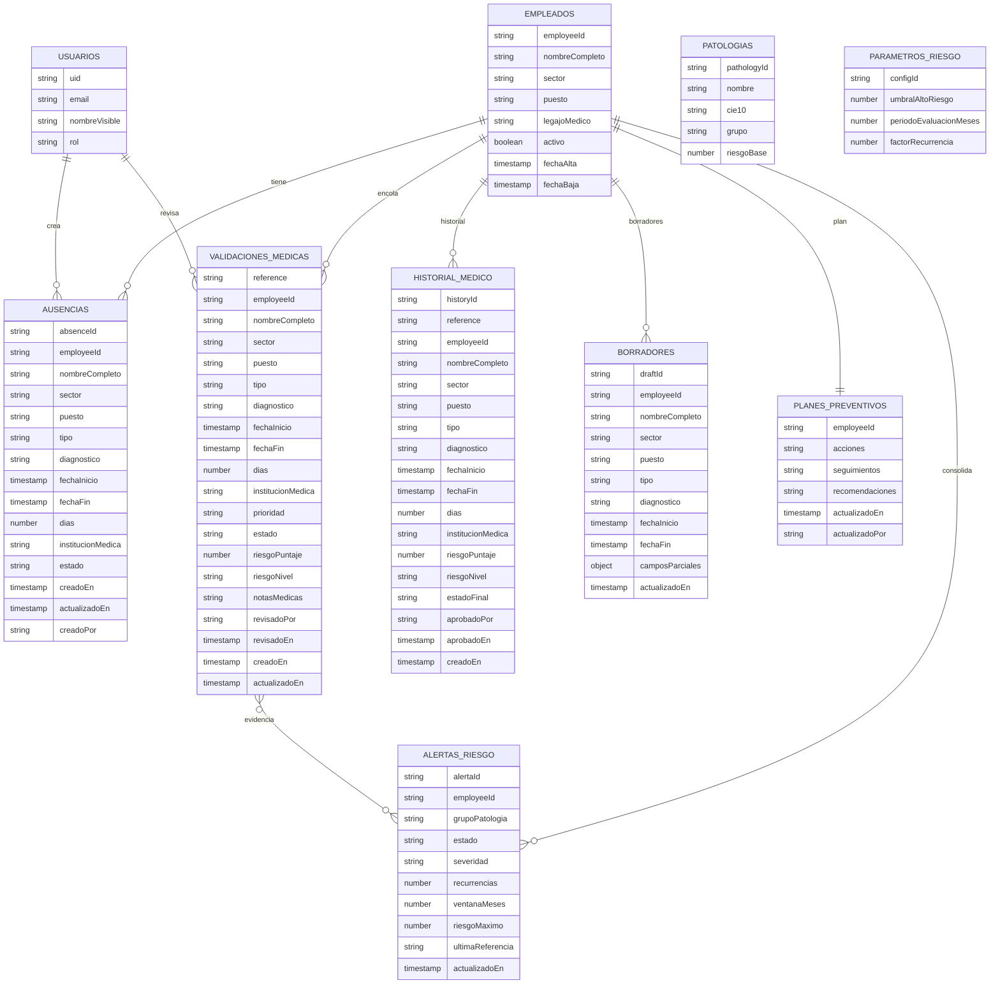

# Esquema Firestore

Este esquema es la referencia funcional para el modo Firebase. El sistema
mantiene persistencia local como respaldo operativo, pero en modo Firebase
sincroniza e hidrata datos contra estas colecciones.

## Colecciones y documentos

1) `empleados/{employeeId}`
- employeeId (string)
- nombreCompleto
- sector
- puesto
- legajoMedico
- activo (bool)
- fechaAlta (timestamp)
- fechaBaja (timestamp | null)

2) `ausencias/{absenceId}`
- absenceId (string)
- referenciaCertificado (string, opcional)
- employeeId
- nombreCompleto
- sector
- puesto
- tipo (accidente/enfermedad/...)
- diagnostico
- requiereAprobacion (si/no)
- grupoPatologia
- cie10
- observacionesAdicionales
- fechaInicio (timestamp)
- fechaFin (timestamp)
- dias (number)
- institucionMedica
- certificadoDigital
  - nombre
  - tamano
  - tipoContenido
  - rutaStorage
  - downloadUrl
- estado (borrador | enviado)
- creadoEn, actualizadoEn
- creadoPor (userId/email)

3) `validaciones_medicas/{reference}`
- reference (CM-..., docId)
- employeeId, nombreCompleto
- sector
- puesto
- tipo, diagnostico
- tipoCertificado
- fechaInicio, fechaFin, dias
- fechaEmision, fechaValidez
- institucionMedica
- prioridad (Alta/Media/Baja)
- estado (pendiente | en_revision | validado | rechazado)
- riesgoPuntaje (number)
- riesgoNivel (alta/media/baja)
- notasMedicas
- grupoPatologia
- cie10
- certificadoDigital
  - nombre
  - tamano
  - tipoContenido
  - rutaStorage
  - downloadUrl
- planAcciones[]
- planSeguimientos[]
- planRecomendaciones[]
- revisadoPor, revisadoEn
- creadoEn, actualizadoEn

4) `historial_medico/{historyId}`
- historyId (string, usar reference)
- reference
- employeeId, nombreCompleto
- sector
- puesto
- tipo, diagnostico
- tipoCertificado
- fechaInicio, fechaFin, dias
- fechaEmision
- institucionMedica
- riesgoPuntaje, riesgoNivel
- estadoFinal (validado | rechazado)
- notasMedicas
- grupoPatologia
- cie10
- certificadoDigital
  - nombre
  - tamano
  - tipoContenido
  - rutaStorage
  - downloadUrl
- planAcciones[]
- planSeguimientos[]
- planRecomendaciones[]
- aprobadoPor, aprobadoEn
- creadoEn

5) `borradores/{draftId}`
- draftId
- employeeId, nombreCompleto
- sector
- puesto
- tipo, diagnostico, fechaInicio, fechaFin
- ausenciaDias
- ausenciaLabel
- periodoLabel
- requiereCertificado (bool)
- guardadoEn
- guardadoPor
- camposParciales (object)
- actualizadoEn

6) `planes_preventivos/{employeeId}`
- employeeId
- nombreCompleto
- sector
- puesto
- acciones[]
- seguimientos[]
- recomendaciones[]
- actualizadoEn, actualizadoPor

7) `patologias/{pathologyId}`
- pathologyId
- nombre
- cie10
- grupo
- riesgoBase (number)

8) `parametros_riesgo/{configId}`
- configId
- umbralAltoRiesgo (number)
- periodoEvaluacionMeses (number)
- factorRecurrencia (number)

9) `usuarios/{uid}`
- uid
- email
- nombreVisible
- rol

10) `auditoria/{auditId}`
- id
- eventType
- timestamp
- user
- role
- entityId
- metadata
- creadoEn

11) `operations/{operationId}`
- id
- type
- payload sin `previewUrl` base64
- user
- entityId
- retryCount
- localCreatedAt
- syncedAt

12) `alertas_riesgo/{employeeId__grupoPatologia}`
- alertaId (identificador estable por empleado y grupo)
- employeeId, nombreCompleto
- sector, puesto
- grupoPatologia
- tipo (`riesgo_consolidado`)
- estado (`activa` | `resuelta`)
- severidad (`alta`)
- motivos[] (`recurrencia_diagnostica` | `riesgo_alto`)
- recurrencias, ventanaMeses
- riesgoMaximo, riesgoIndividualMaximo
- referencias[]
- ultimaReferencia, ultimaFecha
- origen (`cloud-functions`), version
- creadoEn, activadoEn, actualizadoEn, resueltoEn

Notas
- Usar reference como docId en validaciones_medicas y historial_medico para evitar duplicados.
- Storage de certificados: `certificados/{reference}/{timestamp}-{filename}`.
- Firestore no debe persistir `previewUrl` local/base64; debe guardar `storagePath` y `downloadUrl`.
- `operations` es bitacora tecnica de sincronizacion; el dato funcional vive en colecciones de dominio.
- Las reglas de Storage aceptan solo PDF/JPG/PNG de hasta 5 MB.
- Las reglas de Firestore limitan datos clinicos a `superAdmin`, `medico` y `administrativoSalud`.
- `alertas_riesgo` es de solo lectura para roles clinicos; solo Cloud Functions escribe o resuelve alertas.

## Diagrama (Mermaid)

