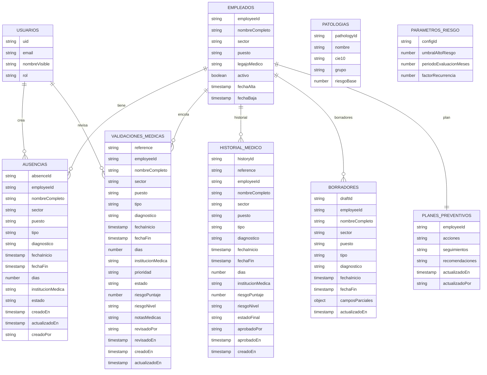

# Esquema Firestore (Propuesta)

## Colecciones y documentos

1) `empleados/{employeeId}`
- employeeId (string)
- nombreCompleto
- sector
- puesto
- legajoMedico
- activo (bool)
- fechaAlta (timestamp)
- fechaBaja (timestamp | null)

2) `ausencias/{absenceId}`
- absenceId (string)
- employeeId
- nombreCompleto
- sector
- puesto
- tipo (accidente/enfermedad/...)
- diagnostico
- fechaInicio (timestamp)
- fechaFin (timestamp)
- dias (number)
- institucionMedica
- certificadoDigital
  - nombre
  - tamano
  - tipoContenido
  - rutaStorage
- estado (borrador | enviado)
- creadoEn, actualizadoEn
- creadoPor (userId/email)

3) `validaciones_medicas/{reference}`
- reference (CM-..., docId)
- employeeId, nombreCompleto
- sector
- puesto
- tipo, diagnostico
- fechaInicio, fechaFin, dias
- institucionMedica
- prioridad (Alta/Media/Baja)
- estado (pendiente | en_revision | validado | rechazado)
- riesgoPuntaje (number)
- riesgoNivel (alta/media/baja)
- notasMedicas
- revisadoPor, revisadoEn
- creadoEn, actualizadoEn

4) `historial_medico/{historyId}`
- historyId (string, usar reference)
- reference
- employeeId, nombreCompleto
- sector
- puesto
- tipo, diagnostico
- fechaInicio, fechaFin, dias
- institucionMedica
- riesgoPuntaje, riesgoNivel
- estadoFinal (validado | rechazado)
- aprobadoPor, aprobadoEn
- creadoEn

5) `borradores/{draftId}`
- draftId
- employeeId, nombreCompleto
- sector
- puesto
- tipo, diagnostico, fechaInicio, fechaFin
- camposParciales (object)
- actualizadoEn

6) `planes_preventivos/{employeeId}`
- employeeId
- acciones[]
- seguimientos[]
- recomendaciones[]
- actualizadoEn, actualizadoPor

7) `patologias/{pathologyId}`
- pathologyId
- nombre
- cie10
- grupo
- riesgoBase (number)

8) `parametros_riesgo/{configId}`
- configId
- umbralAltoRiesgo (number)
- periodoEvaluacionMeses (number)
- factorRecurrencia (number)

9) `usuarios/{uid}`
- email
- nombreVisible
- rol

Notas
- Usar reference como docId en validaciones_medicas y historial_medico para evitar duplicados.
- Storage sugerido: certificados/{reference}/{filename}

## Diagrama (Mermaid)

