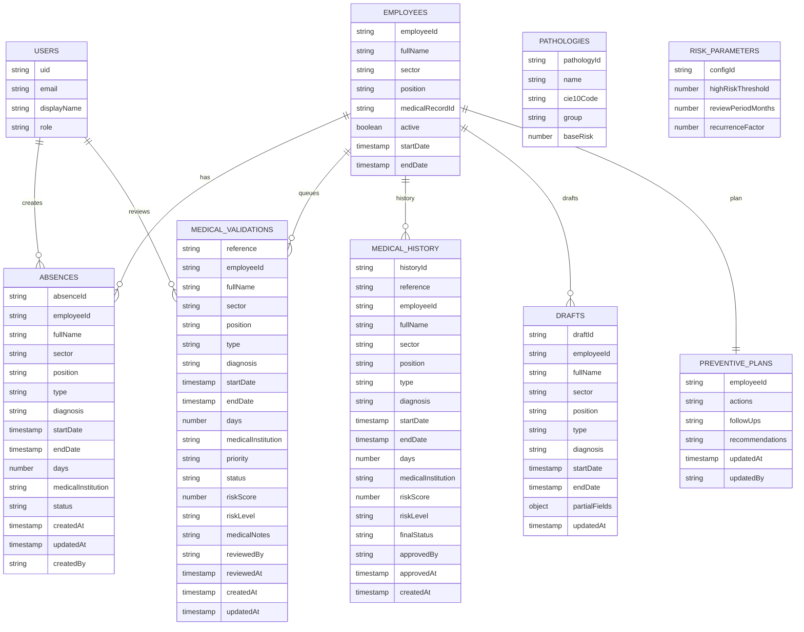

# Esquema Firestore (Propuesta)

## Colecciones y documentos

1) `employees/{employeeId}`
- employeeId (string)
- fullName
- sector
- position
- medicalRecordId
- active (bool)
- startDate (timestamp)
- endDate (timestamp | null)

2) `absences/{absenceId}`
- absenceId (string)
- employeeId
- fullName
- sector
- position
- type (accidente/enfermedad/...)
- diagnosis
- startDate (timestamp)
- endDate (timestamp)
- days (number)
- medicalInstitution
- certificateFile
  - name
  - size
  - contentType
  - storagePath
- status (draft | submitted)
- createdAt, updatedAt
- createdBy (userId/email)

3) `medical_validations/{reference}`
- reference (CM-..., docId)
- employeeId, fullName
- sector
- position
- type, diagnosis
- startDate, endDate, days
- medicalInstitution
- priority (Alta/Media/Baja)
- status (pendiente | en_revision | validado | rechazado)
- riskScore (number)
- riskLevel (alta/media/baja)
- medicalNotes
- reviewedBy, reviewedAt
- createdAt, updatedAt

4) `medical_history/{historyId}`
- historyId (string, usar reference)
- reference
- employeeId, fullName
- sector
- position
- type, diagnosis
- startDate, endDate, days
- medicalInstitution
- riskScore, riskLevel
- finalStatus (validado | rechazado)
- approvedBy, approvedAt
- createdAt

5) `drafts/{draftId}`
- draftId
- employeeId, fullName
- sector
- position
- type, diagnosis, startDate, endDate
- partialFields (object)
- updatedAt

6) `preventive_plans/{employeeId}`
- employeeId
- actions[]
- followUps[]
- recommendations[]
- updatedAt, updatedBy

7) `pathologies/{pathologyId}`
- pathologyId
- name
- cie10Code
- group
- baseRisk (number)

8) `risk_parameters/{configId}`
- configId
- highRiskThreshold (number)
- reviewPeriodMonths (number)
- recurrenceFactor (number)

9) `users/{uid}`
- email
- displayName
- role

Notas
- Usar reference como docId en medical_validations y medical_history para evitar duplicados.
- Storage sugerido: certificates/{reference}/{filename}

## Diagrama (Mermaid)

